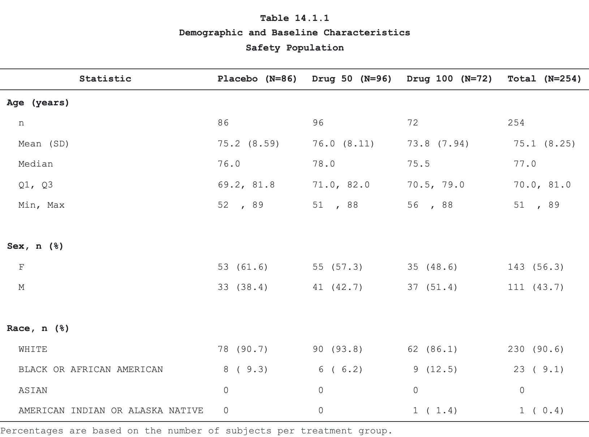

<!-- README.md is generated from README.qmd. Please edit that file -->

# tabular <a href="https://vthanik.github.io/tabular/"></a>

<!-- badges: start -->

[](https://github.com/vthanik/tabular/actions/workflows/R-CMD-check.yaml) [](https://app.codecov.io/gh/vthanik/tabular) [](https://lifecycle.r-lib.org/articles/stages.html#experimental) [](https://www.repostatus.org/#active) <!-- badges: end -->

**tabular** turns a pre-summarised data frame into a submission-grade clinical table and emits it natively to **RTF, PDF, HTML, LaTeX, and DOCX** — no Java, no LibreOffice, no Word automation. One short pipeline gives you decimal alignment via real font metrics, multi-level column headers, predicate-targeted styling, and group-aware pagination, built for CDISC ADaM workflows and FDA / EMA / PMDA submissions.

It is the only R table package that pairs a **live HTML preview** with a **paginated print deliverable**: the same spec you eyeball in a notebook is the one that paginates into the RTF you ship.

## Installation

``` r
# install.packages("pak")
pak::pak("vthanik/tabular")
```

## A table in one pipeline

The pipeline starts from a pre-summarised wide data frame (one row in = one display row — `tabular` does no aggregation) and chains one verb per concern. Every verb returns an updated, immutable `tabular_spec`; the engine resolves it at render time.

``` r
library(tabular)

# BigN denominators, keyed by arm
n <- stats::setNames(saf_n$n, saf_n$arm_short)

# columns render in data-frame order, so put them in dose order first;
# subset to Age / Sex / Race for a compact display
keep <- c("Age (years)", "Sex, n (%)", "Race, n (%)")
demo <- saf_demo[saf_demo$variable %in% keep, c("variable", "stat_label", "placebo", "drug_50", "drug_100", "Total")]

tab <- tabular(
  demo,
  titles = c(
    "Table 14.1.1",
    "Demographic and Baseline Characteristics",
    "Safety Population"
  ),
  footnotes = "Percentages are based on the number of subjects per treatment group."
) |>
  cols(
    variable   = col_spec(usage = "group", label = "Characteristic"),
    stat_label = col_spec(label = "Statistic"),
    placebo    = col_spec(label = sprintf("Placebo (N=%d)",  n["placebo"]),  align = "decimal"),
    drug_50    = col_spec(label = sprintf("Drug 50 (N=%d)",  n["drug_50"]),  align = "decimal"),
    drug_100   = col_spec(label = sprintf("Drug 100 (N=%d)", n["drug_100"]), align = "decimal"),
    Total      = col_spec(label = sprintf("Total (N=%d)",    n["Total"]),    align = "decimal")
  )

# render to any backend by file extension (or format = "...")
path <- emit(tab, tempfile(fileext = ".rtf"))   # submission deliverable
```

The same `tab` emits to every backend from the one spec. The table below is tabular’s own HTML render — the identical spec also produces RTF, a paginated PDF, a `tabularray` LaTeX fragment, and native OOXML `.docx`:

<div align="center">



</div>

## Why tabular?

- **Five native backends, one spec.** `emit()` dispatches on the file extension to RTF 1.9.1, PDF (via `tinytex`), self-contained Bootstrap HTML, `tabularray` LaTeX, and native OOXML DOCX. No JVM, no Office round-trip.
- **Decimal alignment that survives the page.** Numbers align on the decimal using the backend’s real font metrics, not guessed padding — so columns stay aligned in print, not just on screen.
- **Submission chrome built in.** Multi-line titles, up to eleven footnote lines, page header/footer slots, and the four-section page layout regulatory reviewers expect.
- **Group-aware pagination.** Keep a SOC and its preferred terms on one page, repeat titles/headers/footnotes per page, control orphan/widow rows, and split wide tables into horizontal panels.
- **Display-only by design.** `tabular` styles and renders; it never filters, aggregates, or weights. Pair it with `cards` / `gtsummary` / `dplyr` / SAS upstream and feed it a tidy wide frame.
- **A QC trail.** `emit(data_file = ...)` writes the resolved wide data beside the render, and a CDISC ARS audit manifest documents the display.

## Where tabular fits

`tabular` is a *renderer* for pre-summarised clinical tables, not a statistics engine. Compute the summary upstream — with `cards`, `gtsummary`, `dplyr`, or SAS — then hand the finished wide frame to `tabular()`. Reach for `gtsummary` or `rtables` when you want the package to *compute* the summary; reach for `tabular` to *render* a summary you already have to submission-grade output.

The matrix reflects each package’s documented export surface (verified against their namespaces; `via gt` means `gtsummary` renders through `gt`):

|  | tabular | gt | rtables | gtsummary | flextable | huxtable |
|----|:--:|:--:|:--:|:--:|:--:|:--:|
| Computes statistics | — | — | ✓ | ✓ | — | — |
| Live HTML preview | ✓ | ✓ | ✓ | ✓ | ✓ | ✓ |
| Native RTF | ✓ | ✓ | — | via gt | ✓ | ✓ |
| Native DOCX | ✓ | ✓ | — | via gt | ✓ | ✓ |
| LaTeX | ✓ | ✓ | — | via gt | — | ✓ |
| PDF | ✓ | ✓ | ✓ | via gt | — | ✓ |
| Paginated submission output | ✓ | — | ✓ | — | — | — |
| Decimal align via font metrics | ✓ | — | — | — | — | — |
| CDISC ARS audit manifest | ✓ | — | — | — | — | — |

## The verb surface

| Verb | Role |
|----|----|
| `tabular()` | Wrap a pre-summarised data frame into a `tabular_spec` |
| `pivot_across()` | Bridge a `cards` long ARD into a wide display frame |
| `cols()` / `col_spec()` | Per-column usage, label, format, alignment, width, visibility |
| `headers()` | Multi-level column-header bands with passthrough leaves |
| `sort_rows()` | Output row order; factor-aware, NA-last |
| `subgroup()` | Partition the table into page-broken, banner-labelled groups |
| `paginate()` | Page splits, group-keep, panels, repeat chrome, orphan/widow |
| `style()` + `cells_*()` | Predicate-targeted styling for any surface |
| `brdr()` | Border-line specification (width / style / colour) |
| `preset()` / `set_preset()` / `preset_minimal()` | Page geometry + cosmetic defaults |
| `style_template()` | Reusable house style attached to a preset |
| `md()` / `html()` | Inline Markdown / HTML markup in labels and cells |
| `emit()` | Render to a file (RTF / PDF / HTML / LaTeX / DOCX) |
| `as_grid()` | Resolve to the backend-ready grid without writing a file |

## Demo data

Eleven pre-summarised datasets ship with the package to power every example, vignette, and test (the `*_card` pair are long-format `cards` ARDs that feed `pivot_across()`):

| Dataset | Content |
|----|----|
| `saf_demo`, `saf_demo_card` | Demographics, Safety Population |
| `saf_aeoverall` | High-level adverse-event summary |
| `saf_aesocpt`, `saf_aesocpt_card` | Adverse events by SOC and Preferred Term |
| `saf_vital` | Vital signs by parameter and visit |
| `saf_subgroup` | Vital signs by Sex × Age-group subgroups |
| `eff_resp` | Best Overall Response and response rates |
| `eff_estimates` | Treatment-effect estimates (raw numerics) |
| `saf_n`, `eff_n` | BigN denominators per arm |

## Documentation

- [Get started](https://vthanik.github.io/tabular/articles/tabular.html) — your first table in ten minutes
- [Core concepts](https://vthanik.github.io/tabular/articles/core-concepts.html) — the mental model
- [Clinical cookbook](https://vthanik.github.io/tabular/articles/clinical-cookbook.html) — six complete production tables
- [Reference](https://vthanik.github.io/tabular/reference/index.html) — every verb, grouped by role

## License

MIT © Vignesh Thanikachalam
