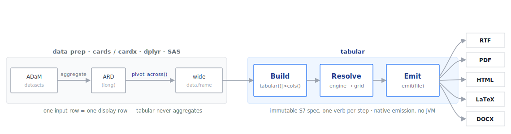

```{r}
#| include: false
knitr::opts_chunk$set(collapse = TRUE, comment = "#>")
```

```{r}
#| label: setup
library(tabular)
```

Four ideas explain almost everything in `tabular`. Once they click, the
rest of the guide is just options.

## 1. The wide-data contract

`tabular` is a **renderer**, not a statistics engine. It assumes the
numbers are already computed and laid out the way you want to display
them: **one row of input is one row of output**, and each column is a
value to show.

```{r}
#| label: contract
head(saf_demo, 6)
```

There is no `group_by`, no counting, no percentages inside `tabular`. You
produce that summary upstream — with `cards`, `gtsummary`, `dplyr`, or
SAS — and hand the finished wide frame to `tabular()`.

::: {.callout-important}
## This is the most common beginner mistake

If you pass *patient-level* data (one row per subject), `tabular` will
faithfully render thousands of rows. It is not broken — it is doing
exactly what it promises. Summarise first, then render.
:::

::: {.callout-tip}
## Coming from gtsummary or rtables?

Those packages *compute* the summary and render it in one step.
`tabular` deliberately splits the two: bring your own summary, get
submission-grade output across five formats.
:::

## 2. The anatomy of a clinical table page

A submission table is not just a grid of numbers. It is a page with four
stacked sections, and reviewers expect each one in its place:

{fig-alt="Header section, title lines, data section, and footnote lines stacked down a page"}

1. **Header section** — protocol, optional status, page *x* of *y*.
2. **Title lines** — table number and up to four centred title rows.
3. **Data section** — optional subgroup banner, the column-header band
   between solid rules, then the data.
4. **Footnote lines** — user footnotes, then the program path, name, and
   timestamp.

Every `tabular` verb maps onto a piece of this picture: `titles`/
`footnotes` fill sections 2 and 4, `footnote()` adds auto-numbered
markers that anchor a cell to its note in section 4, `headers()` and
`cols()` build the column band in section 3, `subgroup()` adds the
banner, and `preset()` controls the page geometry that frames all four.

## 3. A pipeline of immutable verbs

You build a table by piping a `tabular_spec` through verbs. Each verb
returns a **new** spec with one thing changed; the previous spec is never
mutated.

```{r}
#| label: immutable
base <- tabular(saf_demo) |>
  cols(
    variable   = col_spec(usage = "group"),
    stat_label = col_spec(label = "Statistic"),
    placebo    = col_spec(label = "Placebo",  align = "decimal"),
    drug_50    = col_spec(label = "Drug 50",  align = "decimal"),
    drug_100   = col_spec(label = "Drug 100", align = "decimal"),
    Total      = col_spec(label = "Total",    align = "decimal")
  )

is_tabular_spec(base)
```

Because specs are immutable, you can branch a common base into several
variants without surprises — a safety table and its minimal-theme twin
share the same `base` and diverge only at the last verb.

## 4. Three phases: Build, Resolve, Emit

Nothing is rendered while you pipe. The work happens in three phases:

{fig-alt="Pre-summarised data flows through Build, Resolve, and Emit to five output formats"}

- **Build** — the verbs (`tabular()`, `cols()`, `headers()`, …)
  accumulate an immutable spec.
- **Resolve** — the engine turns the spec into a `tabular_grid`: it
  sorts rows, flattens headers, applies styles, formats and
  decimal-aligns cells, and paginates.
- **Emit** — a backend serialises the grid to RTF, PDF, HTML, LaTeX, or
  DOCX.

`emit()` runs Resolve then Emit for you. To inspect the resolved grid
without writing a file, call `as_grid()`:

```{r}
#| label: as-grid
g <- as_grid(base)
is_tabular_grid(g)
```

::: {.callout-note}
## One spec, five renderers

Resolve is backend-agnostic; only Emit differs per format. That is why
the HTML you preview in a notebook and the RTF you ship come from the
*same* resolved grid — the numbers and structure cannot drift between
preview and deliverable.
:::

## 5. Why decimal alignment (and monospace) matters

Submission numbers align on the decimal point so a reviewer can scan a
column at a glance. `tabular` does this with the backend's real font
metrics, which is why the rendered table cells use a monospace face:

```{r}
#| label: decimal
tabular(saf_aeoverall) |>
  cols(
    stat_label = col_spec(label = "Adverse Events"),
    placebo    = col_spec(label = "Placebo",  align = "decimal"),
    drug_50    = col_spec(label = "Drug 50",  align = "decimal"),
    drug_100   = col_spec(label = "Drug 100", align = "decimal"),
    Total      = col_spec(label = "Total",    align = "decimal")
  )
```

The counts and percentages line up on the decimal regardless of how many
digits each value has — and they stay aligned when the table paginates
onto a printed page.

## Where to next

With the model in hand, the rest of the guide fills in the options:

- **[Columns & headers](columns-and-headers.html)** — the column surface.
- **[Rows, grouping & pagination](rows-grouping-pagination.html)** — row
  order, groups, and page splits.
- **[Styling](styling.html)** — `style()`, presets, and house styles.
- **[Architecture](https://vthanik.github.io/tabular/articles/architecture.html)** — the engine phases in depth.
